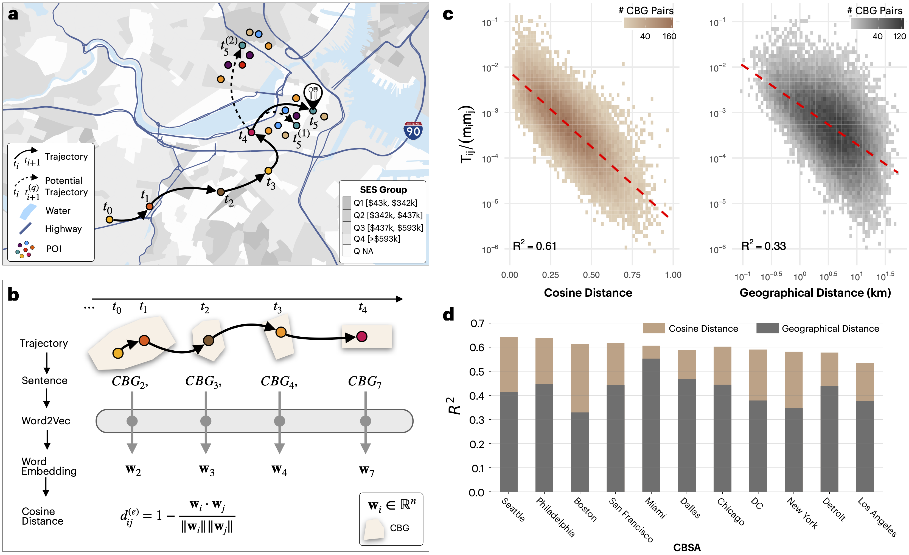

# Beyond Distance: Mobility Neural Embeddings Reveal Visible and Invisible Barriers in Urban Space

<div align="center">

<!-- PDF link needs to be updated later -->
[[PDF](./assets/2506.24061v1.pdf)]
[[Arxiv](https://arxiv.org/abs/2506.24061)]
[[SUN Lab](https://www.socialurban.net)]

<!-- insert figure -->


</div>

This is the official repository for the [Beyond Distance: Mobility Neural Embeddings Reveal Visible and Invisible Barriers in Urban Space](https://arxiv.org/abs/2506.24061) by [Guangyuan Weng](https://gweng.netlify.app), [Minsuk Kim](https://sites.google.com/view/danielhankim/home), [Yong-Yeol Ahn](https://yongyeol.com) and [Esteban Moro](https://estebanmoro.org).


## Abstract
Human mobility in cities is shaped not only by visible structures such as highways, rivers, and parks but also by invisible barriers rooted in socioeconomic segregation, uneven access to amenities, and administrative divisions. Yet identifying and quantifying these barriers at scale and their relative importance on people's movements remains a major challenge. Neural embedding models, originally developed for language, offer a powerful way to capture the complexity of human mobility from large-scale data. Here, we apply this approach to 25.4 million anonymized observed trajectories across 11 major U.S. cities, learning mobility embeddings that reveal how people move through urban space. These mobility embeddings define a functional distance between places, allowing us to detect barriers between neighborhoods that are geographically close but behaviorally disconnected. We find that the strongest predictors of these barriers are differences in access to amenities, administrative borders, and residential segregation by socioeconomic status and race. These invisible borders are concentrated in urban cores and persist across cities, spatial scales, and time periods. Physical infrastructure, such as highways and parks, plays a secondary but still significant role, especially at short distances. We also find that individuals who cross barriers tend to do so outside of traditional commuting hours and are more likely to live in areas with greater racial diversity, and higher transit use or income. Together, these findings reveal how spatial, social, and behavioral forces structure urban accessibility and provide a scalable framework to detect and monitor barriers in cities, with applications in planning, policy evaluation, and equity analysis.

## Usage
+ To install the required Python packages, run the following command,
  ```
  conda env create -f environment.yml
  ```
+ All data needed to reproduce the figures are in [./data](./data).

+ All scripts to generate the figures in the main paper are in [./scripts](./scripts).

+ All generated figures in the main paper are in [./outputs](./outputs).

## Acknowledgement
We thank Hamish Gibbs, Saumitra Kulkarni, and Bijin Joseph, Luca Aiello, and Dakota Murray for their valuable insights on the paper. We also thank Nicole Samay for her suggestions on graphic design. E.M. and G.W. acknowledge support from the U.S. National Science Foundation under Grants 2420945 and 2427150. 

## Citation
If you find our paper useful in your research, please consider citing,
```
@misc{weng2025distancemobilityneuralembeddings,
      title={Beyond Distance: Mobility Neural Embeddings Reveal Visible and Invisible Barriers in Urban Space}, 
      author={Guangyuan Weng and Minsuk Kim and Yong-Yeol Ahn and Esteban Moro},
      year={2025},
      eprint={2506.24061},
      archivePrefix={arXiv},
      primaryClass={cs.CY},
      url={https://arxiv.org/abs/2506.24061}, 
}
```